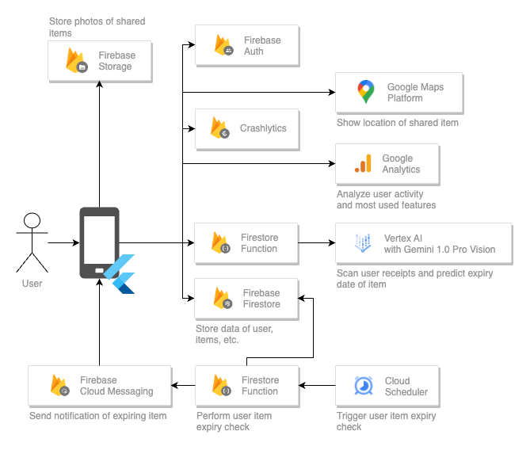

# Too Good To Waste

It seems trivial to throw some rotten food into the trash. 
But if 7 billions people do it for 365 days, we have a global food waste 
problem. The UN Environment Programme mentioned in 2021 that
the global food waste estimated to contribute in the production of 8-10% preventable global 
greenhouse gasses [[1]](https://www.unep.org/resources/report/unep-food-waste-index-report-2021) .
In the same report, they showed that household produces the most 
food waste compared to food services and retails. This problem calls 
for immediate solution on food waste prevention considering it costs 
the global economy more than US$ 1 trillion per year [[2]](https://champions123.org/sites/default/files/2023-10/2023%20Champions%20Progress%20Report.pdf)
.

Understanding the magnitude of this problem, we
introduced Too Good To Waste as a solution that target 
the most prevalent source of food waste — households.
We aim to not only provide a one-time solution on
reducing food waste, but also educating our user into
a healthy and responsible consumption behavior.
We also hope that a better consumption behavior also 
drives a better production behavior.

Our application has the following features:
- Keep track of pantries 
- Notification of expiring items
- Share groceries with other people
- Histories of thrown, shared, and consumed food for motivation and progress tracking
- Points system for motivating user to throw less food
- Automatically scan receipt to import items to database using AI
- Automatically suggest the expiry date based on the category of item using AI


## Architecture

For the system, we use Flutter for our frontend as it offer 
seamless development for multiple mobile OSes (Android and iOS). 
This allows us to reach far more users without 
blowing the development complexities.

As for the backend, we use the Firebase as it
has excellent integration with the Flutter system.

Below is the Diagram of the architecture.



## Deployment

### Firebase

You have to install and configure the [Firebase CLI](https://firebase.google.com/docs/cli).
After that, you just need to run the following command in
project root directory.
```shell
firebase deploy
```

### Flutter

The flutter code is included 
in the `frontend` directory, so make sure to run flutter related commands there. Make sure that you 
already installed the flutter and configured 
a virtual device.

1. First install all dependencies with 
    ```shell
    flutter pub get
    ```
2. Configure the Firebase CLI and Flutterfire CLI by following [this tutorial](https://firebase.google.com/docs/flutter/setup?platform=android)

3. Create a Google Maps Platform API in the Google Cloud and paste the key in the file `frontend/android/app/src/main/AndroidManifest.xml`
    for metadata `com.google.android.geo.API_KEY`

4. Like other usual Flutter applications, you need to run the 
following command
    ```shell
    flutter run
    ```

## Screenshots and Demos

- Home page with shared items list

    
- Detailed information about shared item

    
- User shared items
    
    
- Messaging another user

    
- Notification of soon-expiring item

    
- AI Import ([Video](https://www.youtube.com/shorts/V8854hzOuY8))

## Vision for the Future

We, the Too Good To Waste Team, believe in 
a world without food waste. We know, that it is a long 
shot ahead, but we trust in every little step that
we make today towards a better future.

As the next step, we want to integrate with the 
food banks and other organizations that would 
benefit from this pantries-sharing system.

We also want to create a gamification system
that gives user in-app achievement for 
their accomplishment in reducing their own 
food waste.
